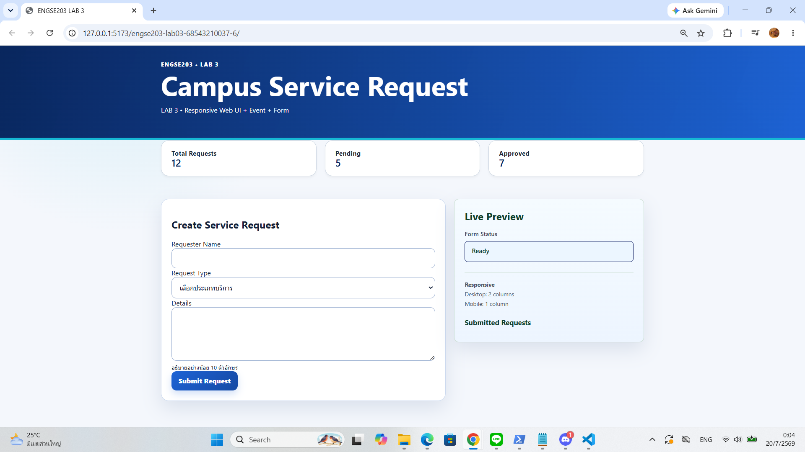
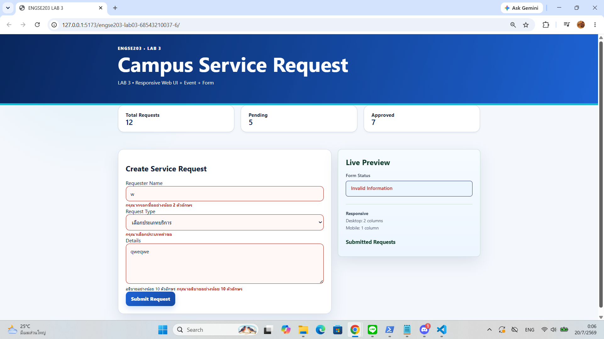
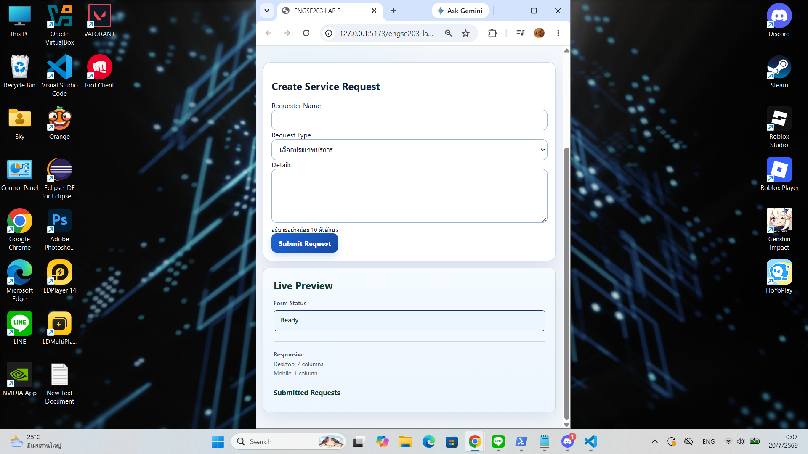

# ENGSE203 LAB 03 — Campus Service Request

## 👤 ข้อมูลผู้จัดทำ (Student Information)
* **ชื่อ-นามสกุล:** นางสาว ภารดี อ่อนรอด (ชมพู่)
* **รหัสนักศึกษา:** 68543210037-6

---

## 📝 รายละเอียดโปรเจกต์ (Project Overview)
ระบบเว็บแอปพลิเคชันสำหรับจัดการคำขอรับบริการภายในวิทยาเขต (Campus Service Request) ซึ่งพัฒนาขึ้นเพื่อศึกษาการจัดการเว็บอินเทอร์เฟซในรูปแบบ Responsive Web UI ร่วมกับระบบดักจับเหตุการณ์ (Event Handling) และการตรวจสอบความถูกต้องของฟอร์มข้อมูล (Form Validation) 

### ฟีเจอร์หลักของระบบ (Key Features)
* **Responsive Layout:** แสดงผลแยกเป็น 2 คอลัมน์บนหน้าจอเดสก์ท็อป (Desktop View) และยุบเหลือ 1 คอลัมน์โดยอัตโนมัติบนหน้าจอมือถือ (Mobile View) เพื่อความเหมาะสมของพื้นที่ใช้งาน
* **Real-time Input Preview:** ระบบแสดงผลตัวอย่างข้อมูลที่ผู้ใช้กำลังพิมพ์กรอกฟอร์ม (Live Preview) ทันทีในส่วนของบ็อกซ์ด้านข้าง โดยจะสลับซ่อน/แสดงอย่างเหมาะสมตามสถานะข้อมูล
* **Form Validation:** ระบบตรวจสอบข้อมูลแบบ Client-side ดักจับการกรอกข้อมูลว่าง, การเลือกประเภทบริการ และตรวจสอบความยาวตัวอักษรของฟอร์มรายละเอียด (Details) ให้มีอย่างน้อย 10 ตัวอักษร พร้อมแสดง Error Warning Message แจ้งให้ผู้ใช้ทราบ
* **Dynamic Content Management:** จัดการประมวลผลข้อมูลสถิติรวมของคำขอ (Total Requests, Pending, Approved) และเพิ่มรายการคำขอที่สำเร็จเข้าสู่ส่วน Submitted Requests แบบไดนามิกโดยตรงด้วย JavaScript เมื่อส่งฟอร์มสำเร็จ

---

## 🚀 วิธีการติดตั้งและรันโปรเจกต์ (How to Run)

1. **Clone Repository:**
   ```bash
   git clone [https://github.com/Paradee1/engse203-lab03-68543210037-6.git](https://github.com/Paradee1/engse203-lab03-68543210037-6.git)

2. เข้าสู่โฟลเดอร์โปรเจกต์:
cd engse203-lab03-68543210037-6

3. ติดตั้ง Dependencies ทั้งหมด (ดาวน์โหลด Vite Development Framework):
npm install

4. เปิดใช้งานโปรเจกต์บนเครื่องเซิร์ฟเวอร์จำลอง (Development Mode):
npm run dev

ระบบจะจำลองเซิร์ฟเวอร์ท้องถิ่นขึ้นมา ให้กดเปิดเว็บบราวเซอร์ไปที่ลิงก์ เช่น http://localhost:5173 เพื่อทดสอบระบบ

5. การคอมไพล์งานเพื่อเตรียมส่ง Production (Build):
npm run build
ไฟล์ปลายทางตัวสมบูรณ์จะถูกสร้างขึ้นในโฟลเดอร์ /docs สำหรับรันบนระบบเซิร์ฟเวอร์ของ GitHub Pages

## 📸 หลักฐานผลลัพธ์การทำงาน (Screenshots Evidence)
1. หน้าจอการทำงานปกติบน Desktop (Desktop 2 Columns View)


2. หน้าจอสถานะเมื่อเกิดการแจ้งเตือนฟอร์ม (Form Validation & Error State)


3. หน้าจอการทำงานบน Mobile (Mobile 1 Column View)


## 🌳 บันทึกประวัติการทำงาน (Git History Evidence)
โปรเจกต์นี้ได้รับการพัฒนาผ่านกระบวนการ Git Workflow อย่างเป็นระบบ โดยทำการแยกกิ่งฟีเจอร์ (Feature Branch) ในการทำงานและบันทึกประวัติข้อความ Commit อย่างต่อเนื่อง สอดคล้องตามลำดับขั้นตอนดังนี้:

chore: scaffold lab 03 page layout and documentation — ขึ้นโครงสร้างไฟล์ HTML, CSS และเขียนโครงร่าง README ตั้งต้น

feat: implement form validation, live preview, and dynamic metrics summary — พัฒนาระบบดักจับเหตุการณ์ จัดการอินพุต ฟอร์ม และแสดงผล Dynamic Content บน main.js

style: enhance responsive form controls and error state layout elements — ปรับปรุงระบบสไตล์ CSS ให้รองรับ Responsive และ Error Handling States ที่สมบูรณ์

docs: finalized README.md with configuration instructions and screenshots — บันทึกภาพหลักฐานผลลัพธ์และสรุปแนวทางการติดตั้งใช้งานตัวจริง

## 📚 References & AI Assistance
ข้อมูลการอ้างอิงเทคนิคทางซอฟต์แวร์ (References)
MDN Web Docs:

การใช้งาน Constraint Validation API และการจัดการอินพุตผ่าน FormData ร่วมกับ Object.fromEntries()

การดักจับ Event แบบเรียลไทม์ด้วย input, submit และการใช้ event.preventDefault() เพื่อควบคุมการทำงานของฟอร์ม

การดีไซน์ Layout ด้วย CSS Grid, Flexbox และการควบคุมหน้าจอ Responsive ผ่าน @media (min-width) queries

Vite Documentation: การตั้งค่าการทำงานและคอมไพล์ระบบเพื่อนำส่งขึ้น GitHub Pages จากโฟลเดอร์ /docs

การใช้งานปัญญาประดิษฐ์ในการทำงาน (AI Assistance Disclosure)
Gemini AI:

ใช้ปรึกษาเทคนิคในการแก้ Logic และควบคุมซ่อน/แสดงส่วนพรีวิว <dl id="preview"> ผ่าน style.display ในไฟล์ JavaScript