# ENGSE203 LAB 4 — Student Evidence README

## ผู้จัดทำ

- ชื่อ–นามสกุล: ภารดี อ่อนละออ
- รหัสนักศึกษา: 68543210037-6
- Section: 1

## URLs

- Repository: https://github.com/Paradee1/engse203-student-labs-68543210037
- Pull Request: https://github.com/Paradee1/engse203-student-labs-68543210037/pull/11
- GitHub Pages: https://Paradee1.github.io/engse203-student-labs-68543210037/labs/week-04/

## Component Tree

```text
App (Owner of requests, currentFilter, formData, errors state)
├── AppHeader (Receives title, subtitle props)
├── SummaryPanel (Receives requests prop for dynamic summary calculation)
├── RequestForm (Receives formData, errors props + onChange, onSubmit callbacks)
├── FilterBar (Receives currentFilter prop + onFilterChange callback)
└── RequestList (Receives filtered requests prop + onDelete callback)
    └── RequestCard (Receives request prop + onDelete callback)
```

## Setup และ Run

```bash
nvm use
npm install
npm run dev
npm run check
npm run build
npm run preview
```

## State / Props / Callback Explanation

### State Owners:

App Component เป็นเจ้าของ Root State ได้แก่ requests (รายการคำร้องทั้งหมด), currentFilter (สถานะตัวกรอง)

RequestForm หรือ App จัดการ State formData (Controlled Input) และ errors (Validation State)

### Props Flow (Top-Down):

ข้อมูล requests และ currentFilter ไหลจาก App ลงไปยัง SummaryPanel, FilterBar, และ RequestList

RequestList ทำหน้าที่ map ข้อมูลและส่ง request object แต่ละรายการลงไปที่ RequestCard

### Callback Flow (Bottom-Up):

เมื่อผู้ใช้เปลี่ยนค่าในฟอร์มหรือกรองข้อมูล RequestForm และ FilterBar จะส่งค่ากลับมาอัปเดต State ที่ App ผ่าน Callback (onChange, onSubmit, onFilterChange)

เมื่อคลิกปุ่มลบ RequestCard จะส่ง id ผ่าน onDelete กลับขึ้นมายัง App เพื่อใช้ filter() อัปเดตรายการแบบ Immutable State

## Test Evidence

| Test ID | Actual Result | Pass/Fail | Evidence/Screenshot |
|---|---|---|---|
| TC-01 Initial | แสดงผล Initial requests 3 รายการ และ Summary สรุปยอดถูกต้อง | PASS | 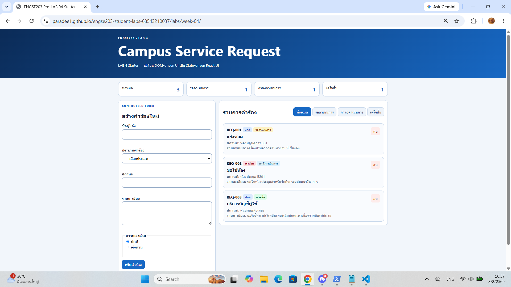 |
| TC-02 Controlled input | ทุก Form Field อัปเดต State ตามการพิมพ์ใน Real-time | PASS | 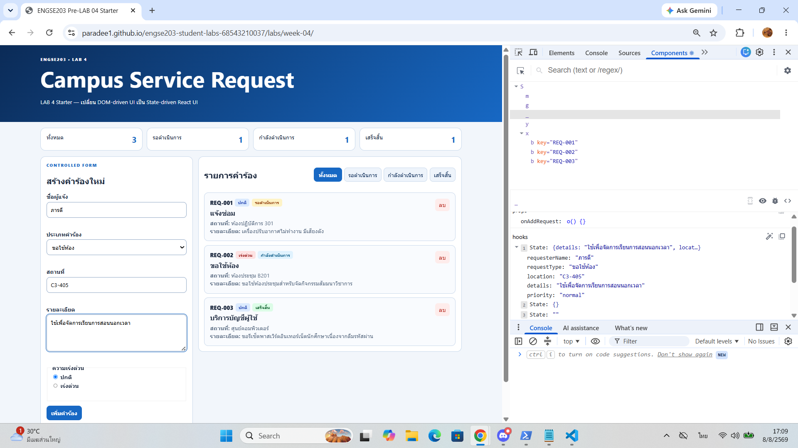 |
| TC-03 Invalid | กรอกข้อมูลไม่ครบ กดส่งแล้วไม่เพิ่มรายการ พร้อมแสดง Error ใกล้ Field | PASS | 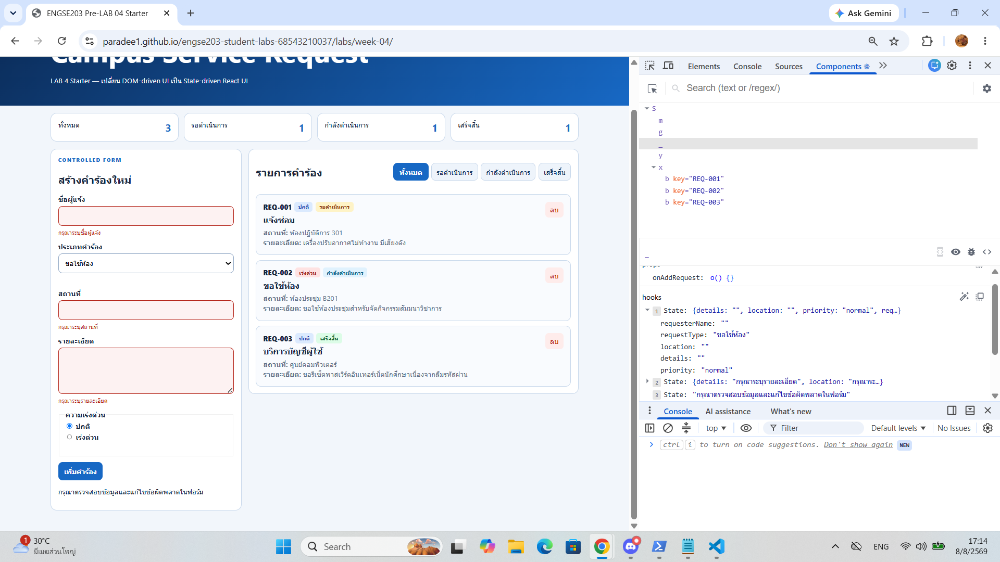 |
| TC-04 Valid add | เพิ่มคำร้องใหม่สถานะ pending ยอดสรุปอัปเดต และฟอร์ม reset | PASS | 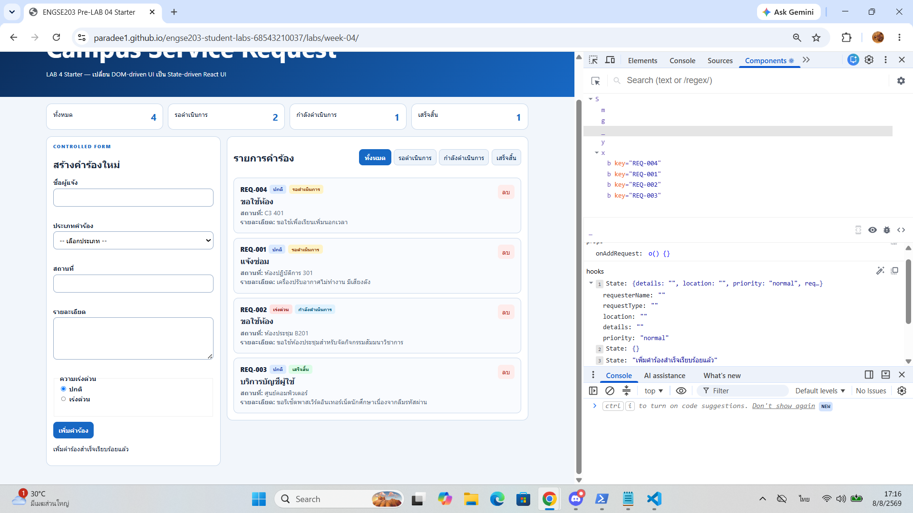 |
| TC-05 Filter | เลือกกรองตามสถานะ แสดงเฉพาะรายการตรงกับเงื่อนไข | PASS | 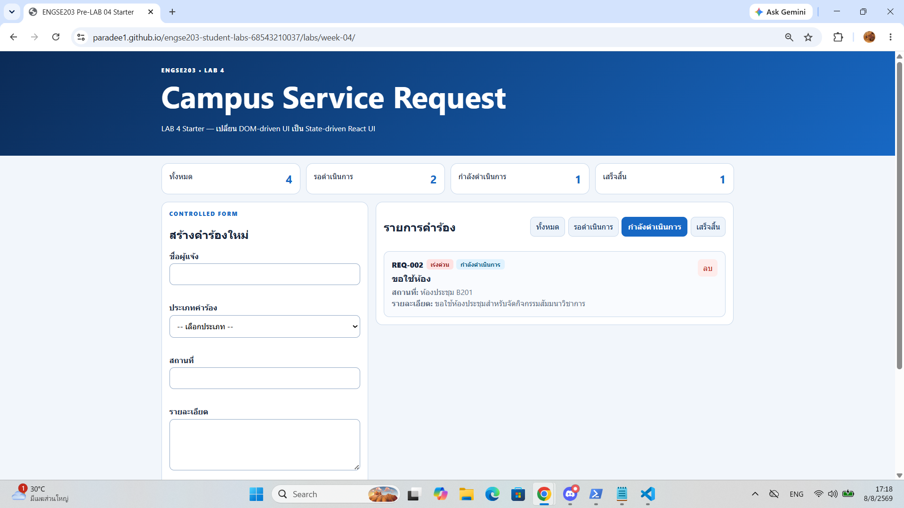 |
| TC-06 All | เลือกตัวกรอง "ทั้งหมด" ระบบกลับมาแสดงคำร้องครบทุกรายการ | TODO | 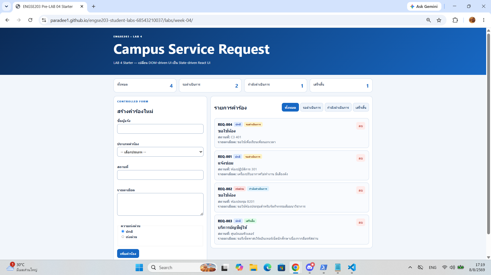 |
| TC-07 Empty | เลือกสถานะที่ไม่พบรายการ แสดงข้อความ Empty State | TODO | 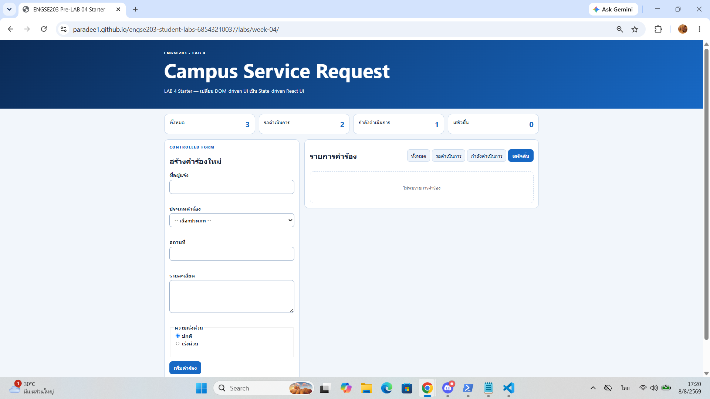 |
| TC-08 Delete | กดลบรายการ ลบข้อมูลตรงตาม ID และ Summary คำนวณใหม่ | TODO | 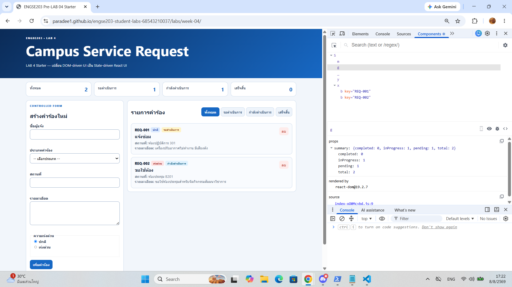 |
| TC-09 Mobile | แสดงผลบนขนาดหน้าจอ 375px สมบูรณ์ ไม่มี Horizontal Scroll | TODO | 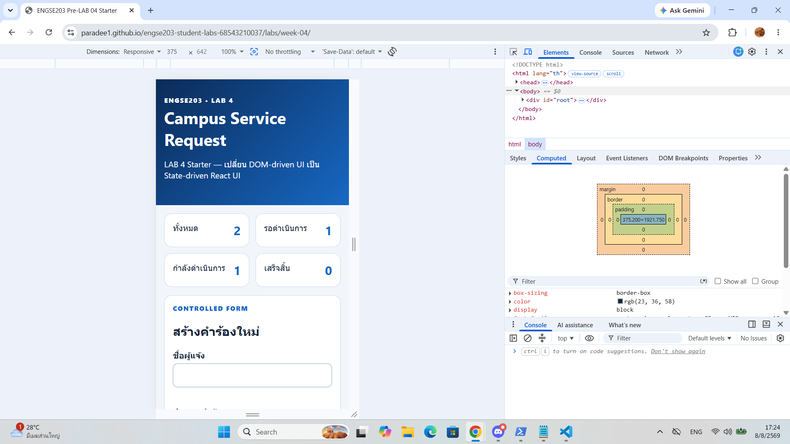 |
| TC-10 Keyboard | สามารถใช้ปุ่ม Tab / Space / Enter โฟกัสและส่งฟอร์มได้ | TODO | 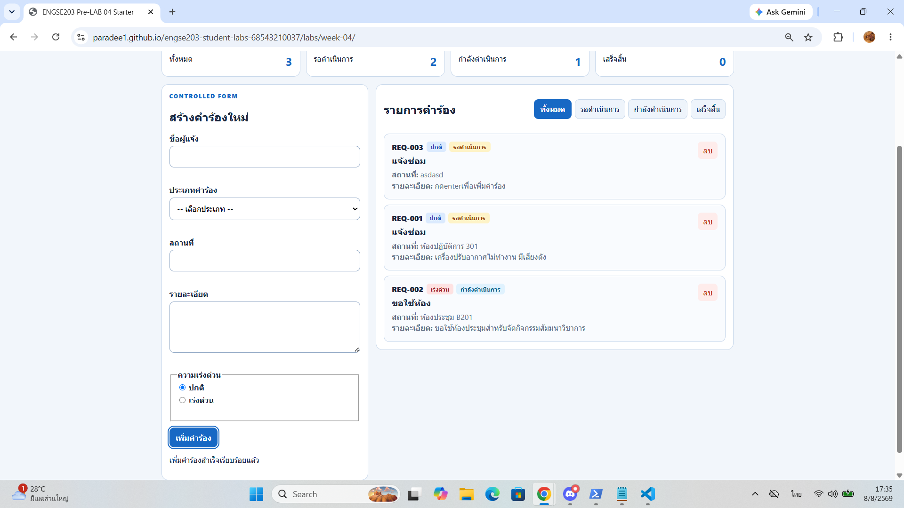 |
| TC-11 Build | รัน npm run build ผ่านสมบูรณ์ สร้างไฟล์ลง dist/ | TODO | 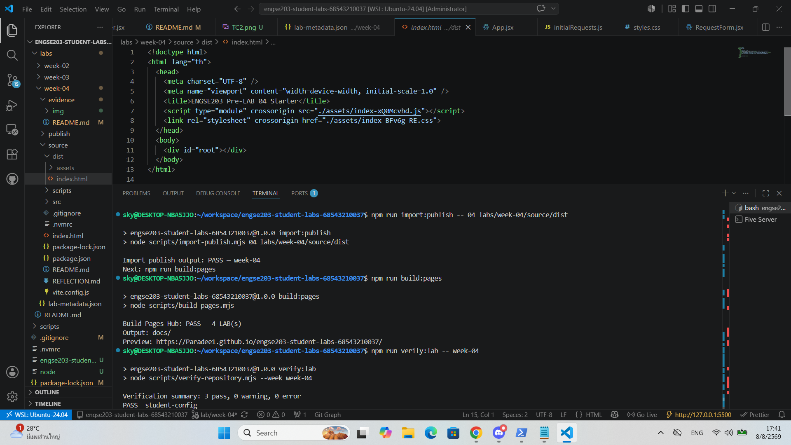 |
| TC-12 Pages | เปิดผ่าน GitHub Pages บน Incognito Mode ทำงานถูกต้อง ไม่มี Console Error | TODO | 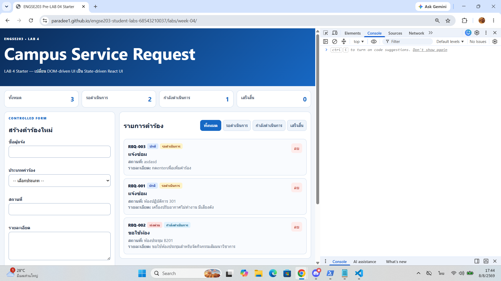 |

## Screenshots

- **Desktop:**
  <br>
  

- **Mobile 375px:**
  <br>
  

- **Validation / Empty State:**
  <br>
  
  <br>
  

## Week 03 → Week 04 Reflection

ใน Week 03 การทำ Web Application ใช้เทคนิค DOM Mutation ในการจับ Element ด้วย JavaScript แล้วแก้ไข innerHTML หรือ Append Node ตรงๆ ซึ่งเสี่ยงต่อการเกิด State ไม่สอดคล้องกันและจัดการโค้ดยากเมื่อแอปมีขนาดใหญ่ขึ้น สำหรับ Week 04 ได้เปลี่ยนมาใช้ React แบบ State-driven UI ซึ่ง UI จะถูก Render ตาม State ปัจจุบันแบบ Declarative โดยอัตโนมัติ การจัดการข้อมูลใช้หลักการ Immutable State ทำให้ติดตามการเปลี่ยนแปลงข้อมูลได้แม่นยำ ปลอดภัย และเขียนโค้ดได้อย่างมีระบบแยกเป็น Components

## AI / External Resource Disclosure

- **เครื่องมือที่ใช้งาน:** Gemini (AI Assistant)
- **ขอบเขตการสนับสนุนของ AI:**
  - ให้คำแนะนำและช่วยตรวจสอบความถูกต้องของโครงสร้าง Component Contract
  - ช่วยวิเคราะห์และแก้ไขปัญหาไฟล์ตั้งค่าการ Deployment
  - ช่วยแก้ปัญหาข้อผิดพลาด (Troubleshooting) จากการรัน สคริปต์ และคำสั่ง Terminal/WSL

