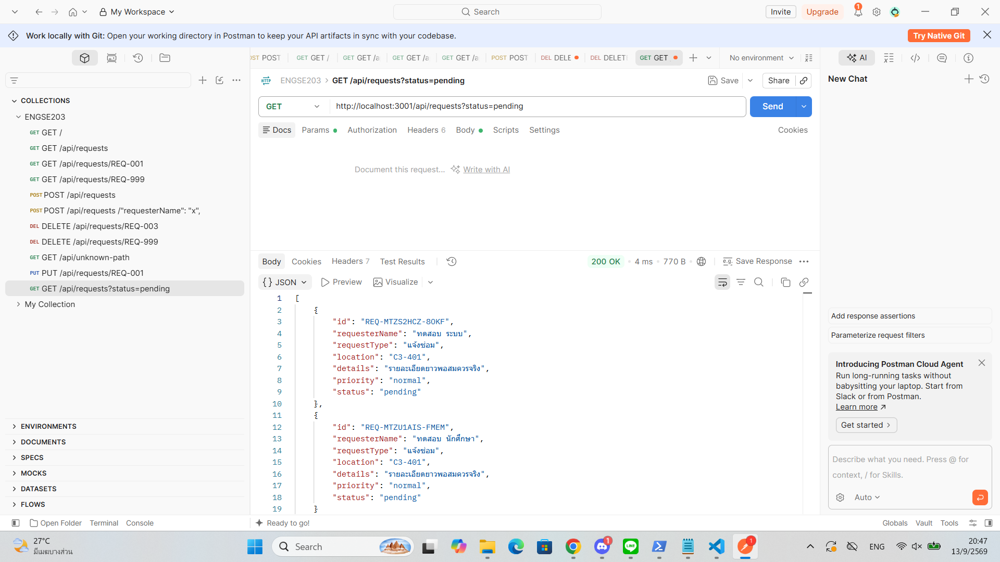
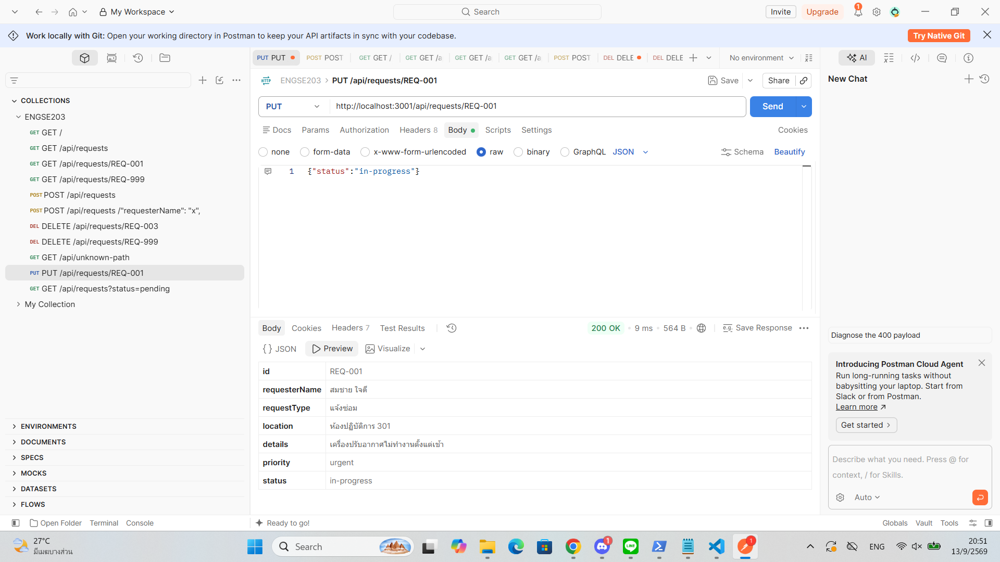
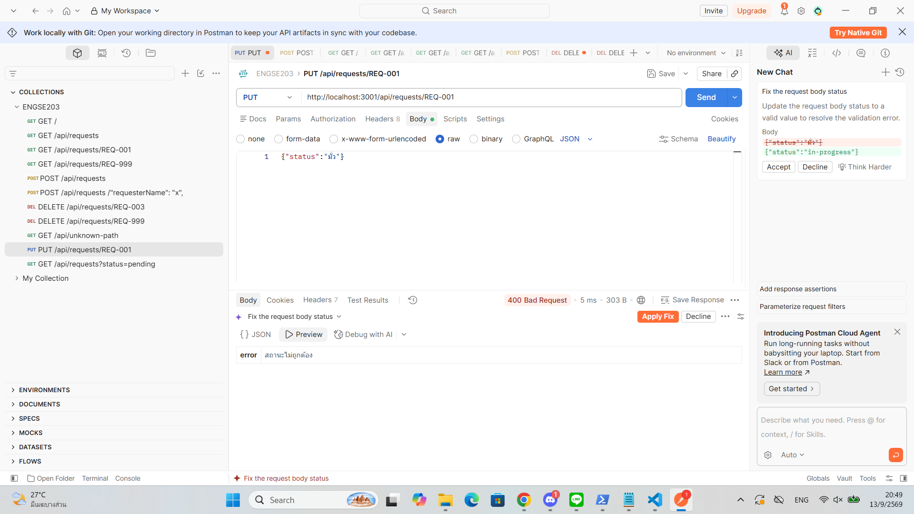
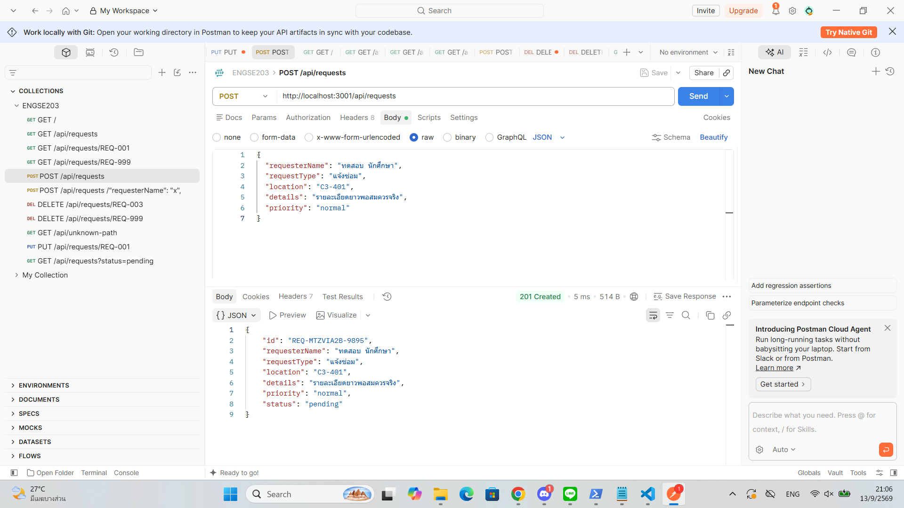
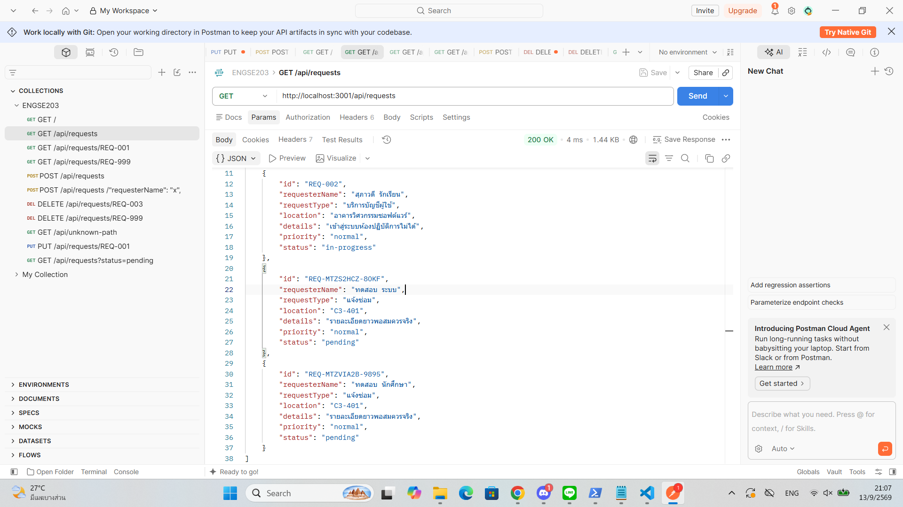
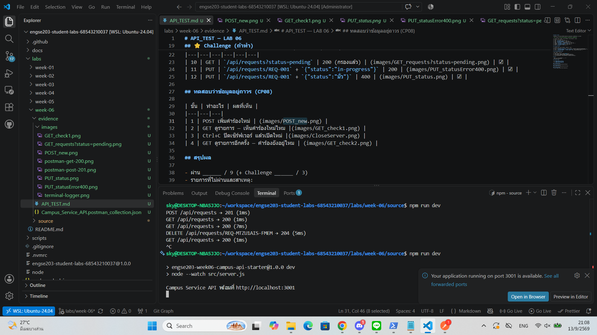
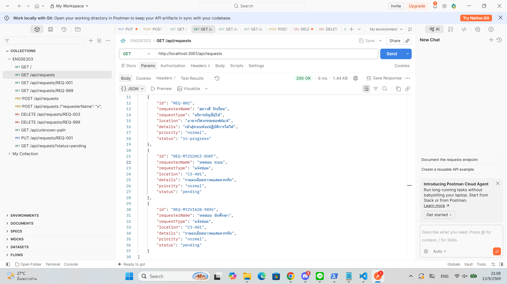
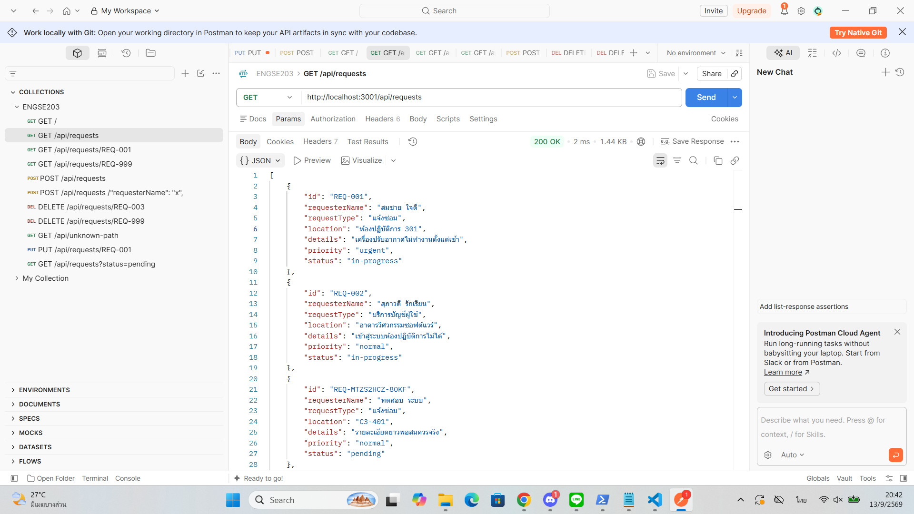
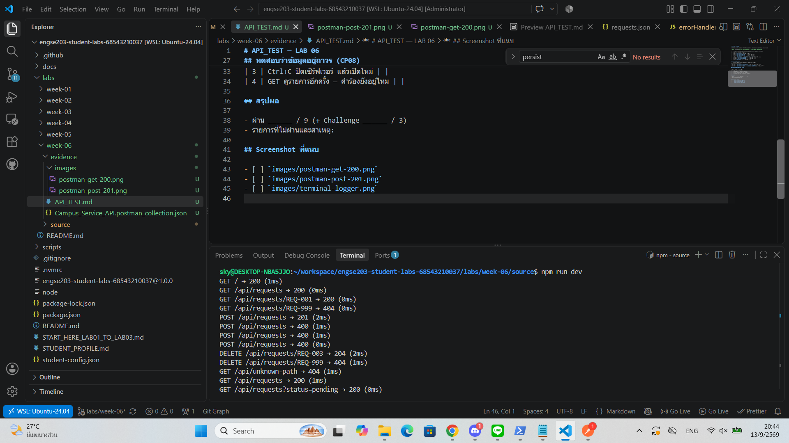

# API_TEST — LAB 06

**ชื่อ–รหัส:** นางสาว ภารดี อ่อนละออ รหัสนักศึกษา 68543210037-6 **วันที่ทดสอบ:** 13/9/2569

> บันทึก **ผลจริง** ที่เห็น ไม่ใช่ผลที่ควรได้ · ถ้าไม่ผ่านให้เขียนว่าไม่ผ่าน

| # | Method | Path | ส่งอะไร | status ที่ควรได้ | status ที่ได้จริง | ผ่าน |
|---|---|---|---|---|---|---|
| 1 | GET | `/` | — | 200 | 200 | ☑ |
| 2 | GET | `/api/requests` | — | 200 | 200 | ☑ |
| 3 | GET | `/api/requests/REQ-001` | — | 200 | 200 | ☑ |
| 4 | GET | `/api/requests/REQ-999` | — | 404 | 404 | ☑ |
| 5 | POST | `/api/requests` | ข้อมูลครบถูกต้อง | 201 | 201 | ☑ |
| 6 | POST | `/api/requests` | `{"requesterName":"x"}` | 400 | 400 | ☑ |
| 7 | DELETE | `/api/requests/REQ-003` | — | 204 | 204 | ☑ |
| 8 | DELETE | `/api/requests/REQ-999` | — | 404 | 404 | ☑ |
| 9 | GET | `/api/unknown` | — | 404 | 404 | ☑ |

## ⭐ Challenge (ถ้าทำ)

| # | Method | Path | status ที่ควรได้ | ที่ได้จริง | ผ่าน |
|---|---|---|---|---|---|
| 10 | GET | `/api/requests?status=pending` | 200 (กรองแล้ว) | `images/GET_requests_pending.png`  | ☑ |
| 11 | PUT | `/api/requests/REQ-001` + `{"status":"in-progress"}` | 200 | `images/PUT_status.png`  | ☑ |
| 12 | PUT | `/api/requests/REQ-001` + `{"status":"มั่ว"}` | 400 | `images/PUT_statusError400.png`  | ☑ |

## ทดสอบว่าข้อมูลอยู่ถาวร (CP08)

| ขั้น | ทำอะไร | ผลที่เห็น |
|---|---|---|
| 1 | POST เพิ่มคำร้องใหม่ | `images/POST_new.png`  |
| 2 | GET ดูรายการ — เห็นคำร้องใหม่ไหม |`images/GET_check1.png`  |
| 3 | Ctrl+C ปิดเซิร์ฟเวอร์ แล้วเปิดใหม่ |`images/CloseServer.png`  |
| 4 | GET ดูรายการอีกครั้ง — คำร้องยังอยู่ไหม | `images/GET_check2.png`  |

## สรุปผล

- ผ่าน 9 / 9 (+ Challenge 3 / 3)
- รายการที่ไม่ผ่านและสาเหตุ:

## Screenshot ที่แนบ

- [x] `images/postman-get-200.png`
- [x] `images/postman-post-201.png`
- [x] `images/terminal-logger.png`

### 1. Postman GET 200

### 2. Postman POST 201

### 3. Terminal Logger
